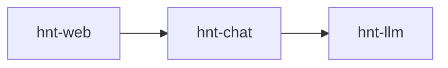

<p align="center">

</p>

<p align="center">
Simple interfaces for interacting with LLMs
</p>

---

## Install

```sh
curl -fsSL https://raw.githubusercontent.com/veilm/hinata/main/install.sh | sh
```

Requirements: Git, Go, Linux/macOS

## What

Hinata gives you three ways to interact with LLMs:

- [`hnt-llm`](cmd/hnt-llm/README.md) sends a prompt to an LLM and streams the response to stdout.
- [`hnt-chat`](cmd/hnt-chat/README.md) keeps conversations as plaintext files and can generate the next response.
- [`hnt-web`](cmd/hnt-web/README.md) provides a browser interface backed by `hnt-chat`.

Use the direct stream interface in scripts, work with conversations from the command line, or open the same conversations in a browser.

## Usage

Send a prompt directly:

```sh
echo "explain quantum computing in one sentence" | hnt-llm
```

Create a file-backed conversation and generate a response:

```sh
conversation=$(hnt-chat new)
printf "Write a haiku about CPUs.\n" | hnt-chat add user -c "$conversation"
hnt-chat gen -c "$conversation" --write
```

Open the web interface:

```sh
hnt-web
```

## Architecture



## Support

[@mislocating](https://x.com/mislocating) · [Issues](https://github.com/veilm/hinata/issues)

## License

MIT
