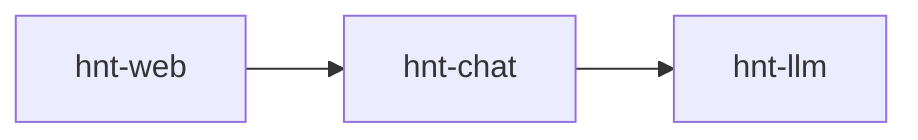

<p align="center">

</p>

<p align="center">
Unix-style, composable LLM utilities for your terminal
</p>

---

## Install

```sh
curl -fsSL https://raw.githubusercontent.com/veilm/hinata/main/install.sh | sh
```

Requirements: Git, Go, Linux/macOS

## What

hinata is a small ecosystem of CLI programs built like classic Unix tools. Each binary is a focused building block you can mix, match, and script together.

**Core tools:**
- [`hnt-llm`](cmd/hnt-llm/README.md) - Direct LLM API access for piping prompts/responses
- [`hnt-chat`](cmd/hnt-chat/README.md) - Plaintext conversation management and memory
- [`hnt-web`](cmd/hnt-web/README.md) - Zero-dependency web UI that speaks to `hnt-chat` for storage/backends

## Usage

Direct LLM interaction:
```sh
echo "explain quantum computing in one sentence" | hnt-llm
```

## Architecture



Additional utilities extend functionality through standard CLI composition.

- `browse`: non-headless (=> high-trust) Chromium browser automation
- `llm-pack`: source bundling files
- `shell-exec`: ultra lightweight, headless shell input/output
- `tui-select`: minimal fzf clone for interactively selecting a line from stdin
- for LLM memory, see [Cathedral](https://github.com/veilm/cathedral)

## Philosophy

- Tools, not frameworks
- Text streams, not APIs
- Composable by humans and LLMs alike
- Fast startup, minimal dependencies

## Support

[@mislocating](https://x.com/mislocating) · [Issues](https://github.com/veilm/hinata/issues)

## License

MIT
