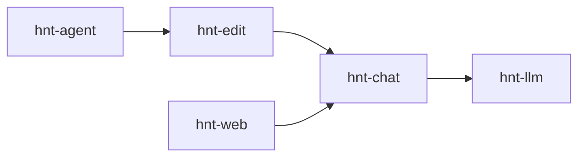

<p align="center">

</p>

<p align="center">
Unix-style, composable LLM utilities for your terminal
</p>

---

## Install

```sh
curl hnt-agent.org/install | sh
```

Requirements: Go, Linux/macOS

## What

hinata is a small ecosystem of CLI programs built like classic Unix tools. Instead of a monolithic "AI pair programmer," each binary is a focused building block you can mix, match, and script together.

**Core tools:**
- `hnt-llm` - Direct LLM API access for piping prompts/responses
- `hnt-chat` - Plaintext conversation management and memory
- `hnt-edit` - Targeted file editing with TARGET/REPLACE blocks
- `hnt-web` - Zero-dependency web UI that speaks to `hnt-chat` for storage/backends
- `hnt-agent` - Lightweight shell automation for single tasks (think "run tests" or "summarize this diff") rather than full pair programming

## Usage

Interactive:
```sh
hnt-agent
```

Let an LLM handle your git workflow, without any prompts:
```sh
hnt-agent --yes --auto-exit -m "check diff and commit with meaningful message"
```

Edit multiple files at once:
```sh
hnt-edit -m "enable debug mode" src/*.h
```

Direct LLM interaction:
```sh
echo "explain quantum computing in one sentence" | hnt-llm
```

## Architecture



Additional utilities extend functionality through standard CLI composition.

- `browse`: non-headless (=> high-trust) Chromium browser automation
- `llm-pack`: source bundling files
- `shell-exec`: ultra lightweight, headless shell input/output
- `tui-select`: minimal fzf clone for interactively selecting a line from stdin
- `hnt-apply`: parse TARGET/REPLACE blocks (used internally by `hnt-edit`)
- for LLM memory, see [Cathedral](https://github.com/veilm/cathedral)

## Philosophy

- Tools, not frameworks
- Text streams, not APIs
- Composable by humans and LLMs alike
- Fast startup, minimal dependencies

## Support

[@sucralose__](https://x.com/sucralose__) · [Issues](https://github.com/veilm/hinata/issues)

## License

MIT
